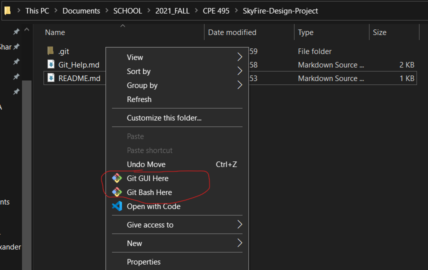
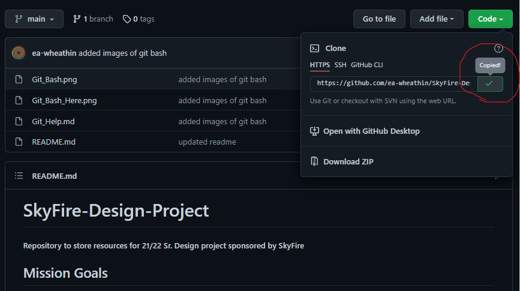
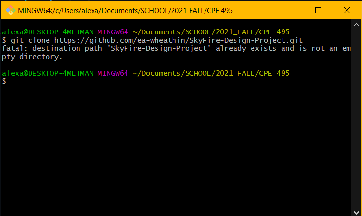
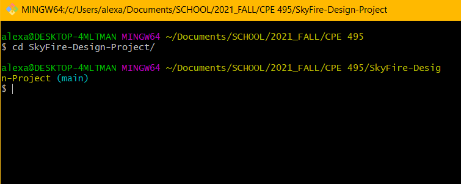

# Getting Started with Git
it's not that hard :) 

# Download Git
[Click Here to Install Git on Windows](https://git-scm.com/download/win)
- [Help with Installing Git and other systems](https://git-scm.com/book/en/v2/Getting-Started-Installing-Git)

# Git Bash

### Open the Git Bash Terminal via File Explorer in the folder you want the repo to be

 
 

### Navigate to the repo on your browser and copy the HTTPS path for cloning

 
 

### Use the Terminal to clone the Git repo to your machine

 
 

### Change Directory into the locally stored repo

 
 

Once you are in the locally stored repo, you can begin working and making commits to the remotely stored repository.

 

# Helpful Links

- [Git Main Site](https://git-scm.com/)
- [Click Here to Install Git on Windows](https://git-scm.com/download/win)
- [Help with Installing Git](https://git-scm.com/book/en/v2/Getting-Started-Installing-Git)
- [Open Git Bash Prompt](https://www.educative.io/edpresso/how-to-install-git-bash-in-windows)
- [Git Reference Docs](https://git-scm.com/docs)
- [Github Ed Git Cheat Sheet](https://education.github.com/git-cheat-sheet-education.pdf)
- [GitLab Git Cheat Sheet](https://about.gitlab.com/images/press/git-cheat-sheet.pdf)
- [Git 101 Blog Post](https://codeburst.io/git-101-git-workflow-to-get-you-started-pushing-code-a66c91108a92)